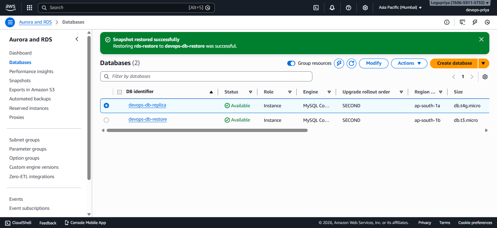

# Explore different Backup and Disaster recovery approaches and understand how to take and restore the backups of EFS, EBS, and RDS.

## Backup
Backup focuses on data protection.  
It ensures that data can be recovered in case of accidental deletion, corruption, or human error
- Scope: Data only
- Main concern: Data loss
- Key metric: RPO (Recovery Point Objective)
- Typical use cases:
  - File deletion
  - Database corruption
  - Application bugs affecting data

## Disaster Recovery (DR)
Disaster Recovery focuses on business continuity and system availability.  
It ensures that applications remain available or can be restored quickly after major failures.

- Scope: Entire system (compute, storage, network, application)
- Main concern: Downtime
- Key metric: RTO (Recovery Time Objective)
- Typical use cases:
  - Availability Zone failure
  - Region outage
  - Infrastructure failure
Key Difference: Backup protects data, while Disaster Recovery protects time and availability

## Recovery Point Objective (RPO)
RPO defines how much data loss is acceptable.
Example:
- If backups are taken every 6 hours, the RPO is up to 6 hours
- This means losing the last 6 hours of data is acceptable
RPO is mainly affected by backup frequency

## Recovery Time Objective (RTO)
RTO defines how long the system can remain unavailable.
Example:
- If restoring services takes 2 hours, then the RTO is 2 hours
RTO is mainly affected by DR architecture and automation

## backup approaches
- Full backup
- incremental backup
- manual backup 
- automatic backup
- point in time backup
- cross regional backup

## Disaster Recovery approaches
- backup & restore (cold standby)
- pilot light 
- warm standby
- multi-site/active-active/hot standby

## take and restore the backups of EBS
Step 1: EC2 instance -> select a running instance -> storage tab -> volume ID where the data of that EC2 instance is stored
Step 2: click on that volume id
Step 3: In volumes tab -> click actions -> create snapshot
Step 4: Snapshot details -> add Description -> create snapshot
Now the sanpshot for that volume is created 

![snapshot for a volume]<Week4\AWS2-Assignment-Day5\SnapshotForEBS.png>

## take and restore the backups of EFS
Step 1: AWS Backup -> Backup -> create backup plan
Step 2: create backup plan -> choose the backup plan option (Build a new plan) -> enter the credentials 
credentials:
Backup plan name: EFS-Backup
Backup rule name: EFS-Backup-rule
Step 3: Assing resource -> enter Resource assignment name -> Assign resource 

![EFS Backup]<Week4\AWS2-Assignment-Day5\EFSBackup.png>

## take and restore the backups of RDS
Step 1: RDS -> Databases -> Select your DB -> Backup & maintenance tab
Step 2: Actions dropdown -> take snapshot -> create a snapshot (rds-restore)
Step 3: RDS -> snapshots -> click rds-restore snapshot -> actions dropdown -> restore snapshot
Step 4: DB instance identifier -> devops-db-restore -> restore DB instance

