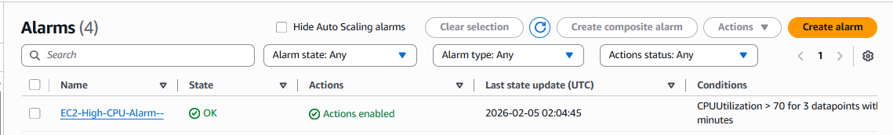

# Create alarm in cloudwatch on the basis of average CPU utilisation for a VM

## Steps:
Open CloudWatch → Alarms
Click Create alarm
Click Select metric

Choose:
AWS namespaces
- EC2
- Per-Instance Metrics
- CPUUtilization

Select your InstanceId
Set:
Statistic: Average
Period: 300 seconds (5 minutes)

Condition
Threshold type: Static
Whenever CPUUtilization is…
Greater than 70
Datapoints to alarm: 3 out of 3 

Notification
Select or create an SNS topic
Add email

![Email confirmation]<Week4\Weekly_Assignment-Week4\Task02\emailConfirmation.png>

Name & Create
EC2-High-CPU-Alarm

