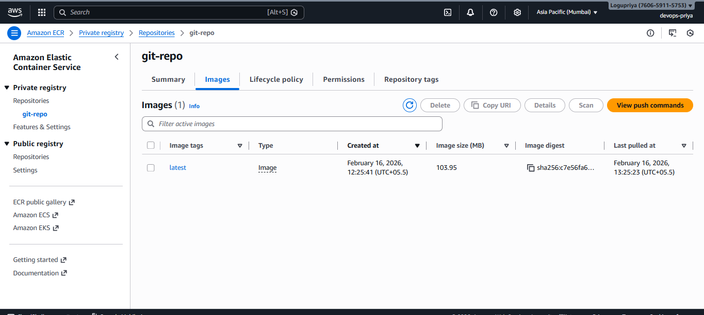

# Create a docker image for installing GIT and push the image to the previously created Elastic Container Registry

## dockerfile
FROM ubuntu:22.04

RUN apt update && \
    apt install -y git && \
    apt clean

CMD ["git", "--version"]

- FROM ubuntu:22.04 -> Uses Ubuntu as base image
- apt install -y git -> Installs Git
- CMD -> Runs git --version when container starts

## Build the docker image
docker build -t git-image .

verify the image using the following command
docker images
output: 
REPOSITORY    TAG       IMAGE ID       CREATED             SIZE
=>"git-image"    latest    46408b4f6562   42 seconds ago      226MB      
myimage       latest    b32ca3b02c02   About an hour ago   84.9MB     
<none>        <none>    50e5bfee4004   2 hours ago         77.9MB     
alpine        latest    a40c03cbb81c   2 weeks ago         8.44MB     
ubuntu        latest    493218ed0f40   4 weeks ago         78.1MB     
ubuntu        22.04     65c77cbc27c2   5 weeks ago         77.9MB     
hello-world   latest    1b44b5a3e06a   6 months ago        10.1kB 

## Authentication docker to ECR
aws ecr get-login-password --region ap-south-1 | \
docker login --username AWS --password-stdin 760659115753.dkr.ecr.ap-south-1.amazonaws.com

output: Login Succeeded

## Tag the image for ECR
docker tag git-image:latest \
760659115753.dkr.ecr.ap-south-1.amazonaws.com/git-repo:latest

## Push the image to ECR
docker push \
760659115753.dkr.ecr.ap-south-1.amazonaws.com/git-repo:latest

output:
The push refers to repository [760659115753.dkr.ecr.ap-south-1.amazonaws.com/git-repo]
e47daac26dc1: Pushed
fbb9bbbaf4d2: Pushed
latest: digest: sha256:c7e56fa64179403e4bd220afd12c5483117a277f5d74c3d5e268a1d05ffe7073 size: 741

## Verification
Login to AWS Console
Switch to region: Asia Pacific (Mumbai) – ap-south-1
Navigate to ECR -> Repositories -> git-repo
Confirm the latest image is visible

