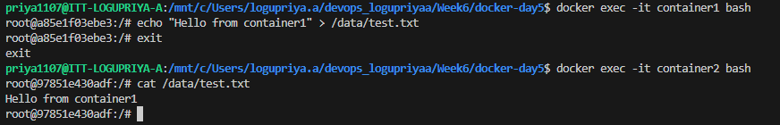

# Create two containers and both the containers should share the common volume

## Method 1 (Using Docker compose)

In this approarch docker compose is used to define and manage multiple containers and a shared volume through single configuration file 

### workflow 
In the docker-compose.yml file, there are 2 services 
    - both the containers uses the same image 
    - comman named volume to an identical directory path (/data)

A named volume is declared at the bottom of the configuration file
When docker compose is executed 
    it automatically creates:
    - The defined containers 
    - The shared named volume
    - The network configuration
Both containers mount the same volume to "/data" => means they refer the same physical location

=> Any file written inside a container is immeadiately accessible to the other container 

## Method 2 (Using docker CLI)
- Manually the containers are created and mount to a common volume by using the following command 
docker run -dit --name container1 -v shared_vol:/data ubuntu 
docker run -dit --name container2 -v shared_vol:/data ubuntu

verification: 
- docker exec -it container1 bash 
> echo "Hello from container1" >/data/test.txt =>exit
- docker exec -it container2 bash
> cat /data/test.txt
>>output: Hello from container1